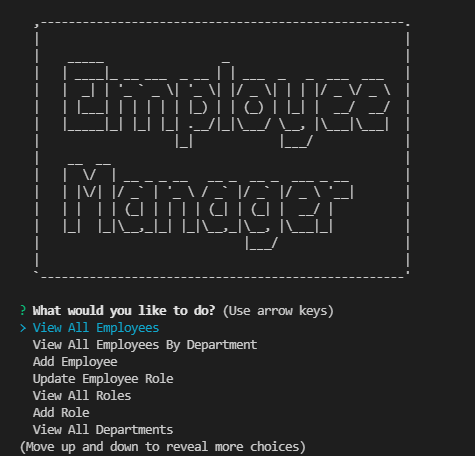

<h1>Employee Tracker</h1>

<h2>Description</h2>
Allows a user to view and manage the departments, roles, and employees of their company.

<h2>Table Of Contents</h2>
<ul><li><a href="#install">Installation</a></li>
<li><a href="#usage">Usage</a></li>
<li><a href="#tech">Technologies</a></li>
<li><a href="#cont">Contributors</a></li>
<li><a href="#test">Test</a></li>
<li><a href="#license">License</a></li></ul>

<h2 id="install">Installation</h2>
To install dependencies use:

<pre>npm install</pre>

<h2 id="usage">Usage</h2>
To start the Employee Tracker use:

<pre>npm start</pre>

<a href="https://watch.screencastify.com/v/Fh2gvG2hRre0EJfx0Ir6">Walkthrough Video on Screencastify</a>

<h2 id="tech">Technologies used:</h2>
<ul>
<li>Node.js</li>
<li>MySQL</li>
<li>Inquirer</li>
</ul>

<h2 id="cont">Contributors</h2>
There were no other contributors.

<h2 id="test">Test</h2>
To run a test use:

<pre>npm test</pre>

<h2 id="license">License</h2>
<a href='https://opensource.org/licenses/MIT'>MIT License</a>